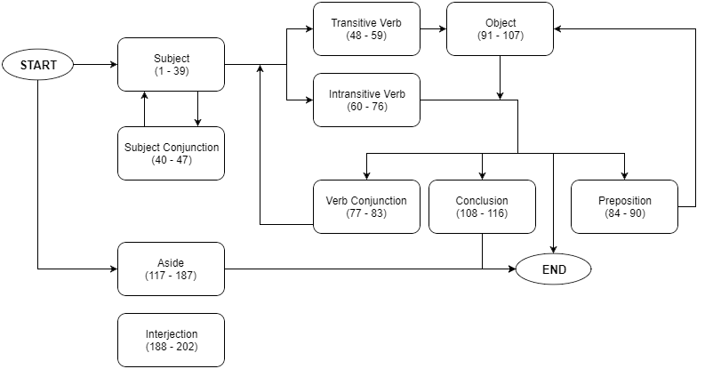

# BoydSimulator

A personal project to recreate the rambling conspiracy theories of Boyd Cooper
from the game *Psychonauts*.

*Psychonauts* generates Boyd's theories using 202 sentence fragments, each of which has
two variants (one for outside of Boyd's mind, and one for inside) giving a total of 404
sound clips. The clips are randomly assembled using the following structure:

This website recreates the same sort of random generation, producing results very similar
to the actual game. Leave the Milkman Conspiracy running in the background for that extra
burst of clarity!

http://www.soltoder.com/BoydSimulator/
